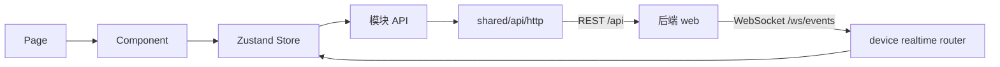

# Lab System Frontend

实验室综合管理系统 React 管理端。当前页面覆盖登录、实验室、设备/网关、实时遥测、设备控制、用户联系人、智能策略和实验室排课。

总体架构见[全栈架构与子模块导读](../PROJECT_ARCHITECTURE_GUIDE.md)，后端接口说明见[后端 README](../lab-system-cloud/README.md)。

## 技术栈

- React 19、TypeScript 5.8、Vite 7。
- React Router 7，路由级懒加载。
- Zustand 5，管理领域和交互状态。
- TanStack Query 5，提供全局 Query Client。
- Axios，访问 REST API。
- Tailwind CSS 4 与全局 CSS。
- Vitest 4、Testing Library、jsdom。

## 页面

| 路由 | 功能 |
| --- | --- |
| `/login` | 登录 |
| `/dashboard` | 工作台 |
| `/devices` | 设备数据中心、遥测和控制 |
| `/devices/manage` | 设备与网关 CRUD、轮询 |
| `/laboratories/manage` | 实验室管理 |
| `/strategies` | 智能策略 CRUD、启停和 revision 编辑 |
| `/accounts` | 系统用户与联系人 |
| `/edu/scheduling` | 学期和实验室排课 |
| `/previews/*` | 无后端依赖的真实组件预览 |

预览页面使用确定性本地数据，并在侧栏“组件预览”中注册。新增或修改可复用业务组件时，应同步维护预览、路由、导航和关键输出状态。

## 目录

```text
src/
├── app/
│   ├── App.tsx            # Query Provider、会话恢复、Router
│   ├── layouts/           # 主布局和导航
│   └── router/            # 业务路由和预览路由
├── modules/
│   ├── auth/              # 会话、登录与路由守卫
│   ├── account/           # 系统用户与联系人
│   ├── laboratory/        # 实验室和全局筛选
│   ├── device/            # 设备、网关、控制、遥测、WebSocket
│   ├── strategy/          # 策略管理与草稿编辑
│   ├── edu/               # 学期、课表与导入
│   ├── dashboard/
│   └── errors/
└── shared/
    ├── api/http.ts        # Axios 与统一错误处理
    ├── components/
    ├── lib/queryClient.ts
    └── styles/
```

模块通常使用 `api / components / pages / store / types` 分层。只有跨多个业务域稳定复用的代码才进入 `shared`。

## 数据与状态



- `authStore` 持久化当前用户；服务端会话仍由 Sa-Token Cookie 决定。
- `laboratoryFilterStore` 保存楼栋、组织、实验室 ID 范围。
- `deviceStore` 以 ID Map 保存设备、网关和遥测，支持实时局部更新。
- `strategyStore` 保存服务端 revision；`strategyDraftStore` 隔离未保存草稿和校验。
- `eduStore` 管理学期和当前课表视图。
- TanStack Query 已装配，但当前大部分服务端请求生命周期仍在 Zustand Store 中。

## API 与会话

Axios 默认配置：

```text
baseURL=/api
timeout=10000
withCredentials=true
```

后端响应为：

```ts
interface ApiEnvelope<T> {
  code: number
  ok: boolean
  data: T
  msg: string
}
```

应用启动时请求 `/api/sessions/current` 恢复会话。非登录请求收到 401 后会清空本地用户并跳转到 `/login`，同时通过 `from` 参数保留原地址。组件预览路由不会请求后端，也不会被登录守卫拦截。

## 实时遥测

主布局挂载 `DeviceRuntime`：

1. 连接同源 `/ws/events`。
2. 校验事件版本、类型、资源和时间。
3. 将设备事件增量写入 `deviceStore`。
4. 断线时指数退避并加入随机抖动，最大 30 秒。
5. 网络恢复或收到 `system.connected` 后重新加载当前实验室快照。
6. 实验室 Scope 变化时刷新设备、网关和最新遥测。

开发环境由 Vite 同时代理 `/api` 和 `/ws`，生产环境由 OpenResty 反向代理。

## 本地开发

```bash
npm ci
cp .env.example .env.local
npm run dev
```

默认地址为 `http://localhost:5173`，API/WebSocket 代理到 `http://localhost:8989`。覆盖后端地址：

```dotenv
VITE_API_PROXY_TARGET=http://localhost:8989
```

## 质量检查

```bash
npm test
npm run typecheck
npm run lint
npm run build
```

当前测试覆盖会话守卫、实验室 Store、设备字段与控制目录、实时事件、核心业务组件、策略草稿和排课布局。

修改组件预览后必须执行类型检查、Lint 和生产构建。

## Docker

```bash
docker compose up --build -d
```

默认访问 `http://localhost:5678`，可通过 `FRONTEND_PORT` 修改：

```bash
FRONTEND_PORT=80 docker compose up --build -d
```

镜像分两阶段：

1. Node 22 执行 `npm ci` 和 `npm run build`。
2. OpenResty 只接收 `dist` 和 Nginx 配置。

OpenResty 提供 SPA fallback、静态资源长期缓存、`/healthz`，并将 `/api/`、`/ws/` 转发到宿主机后端 8989。

## Jenkins

流水线参数：

- `GIT_BRANCH`：远程分支，默认 `main`。
- `GITHUB_SHA`：可选精确提交，优先于分支。
- `DEPLOY_AFTER_BUILD`：构建成功后是否调用受限部署 Webhook。

流水线执行 `npm ci`，并行运行 Lint、Test、Typecheck，然后构建和发布 `dist`。
